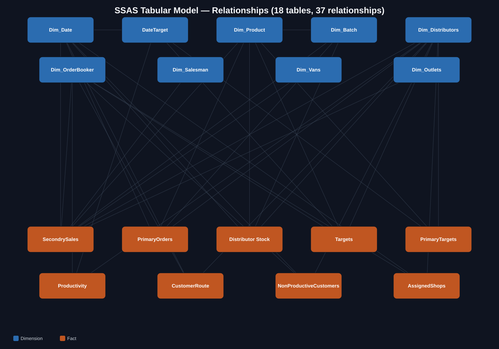

# FMCG-FieldSales-DataWarehouse

End-to-end Data Warehouse project including ETL pipelines, data modeling, SSAS
Tabular semantic layer, and reporting for an FMCG distributor field-sales
analytics system.

---

## Problem Statement

FMCG distributors run field sales through Order Bookers who visit hundreds of
retail outlets daily, book orders, deliver stock, and get paid — all recorded
across several disconnected systems: a route-planning module, an order/invoice
system, a non-productive-visit log, a primary-order (manufacturer-to-warehouse)
system, and a daily stock snapshot. Before this warehouse, each system was
queryable on its own, but nothing tied them together. This created:

- No single, trustworthy answer to "how much did we actually sell today,
  Booked vs. Delivered" — every team computed it slightly differently
- No way to measure route/PJP compliance — did an Order Booker visit who they
  were supposed to, and did unplanned-but-productive visits get any credit?
- No connection between primary sales (stock in) and secondary sales (stock
  out) to catch drift between the two
- No day-level GPS/time compliance visibility into whether a "visit" was real

---

## Solution Overview

This warehouse sits between the OLTP order/route/stock systems and an SSAS
Tabular semantic model, and standardizes the business rules (what counts as a
sale, what counts as a covered outlet) in one place instead of letting every
report re-derive them. The pipeline moves data from the live OLTP database into
a purpose-built galaxy-schema warehouse on a daily incremental cycle, an SSAS
Tabular model sits on top with ~120 DAX measures, and Power BI / Excel both
connect live to that one semantic layer — so Power BI dashboards and Excel
PivotTables always agree with each other.

---

## Architecture


**Tech Stack:**

| Layer | Technology |
|---|---|
| Source (OLTP) | SQL Server — distributor/route/order system |
| ETL | SSIS (SQL Server Integration Services) |
| Data Warehouse | SQL Server — `SalesAssistDWH` |
| Query Language | T-SQL |
| Semantic Layer | SSAS Tabular (DAX) |
| Reporting | Power BI + Excel (Analyze in Excel / PivotTables) |

**Pipeline:**


---

## Data Model

Schema type: **Galaxy Schema (Fact Constellation)** — 9 fact tables sharing a
common set of conformed dimensions.



18 tables · 37 relationships · ~120 DAX measures (see `ssas/model-overview.md`
for the full breakdown and the SSAS-logical-name ↔ physical-table mapping).

**Fact Tables:**

| Table (physical) | SSAS name | Business Domain | Key Measures |
|---|---|---|---|
| `SalesDataDump` | `SecondrySales` | Secondary sales (invoice line) | Net Sales Amount, Secondary Sales Tons, Productive Calls |
| `New_PrimaryOrders` | `PrimaryOrders` | Primary sales (manufacturer → distributor) | Primary Tons, Primary Net Sales Amount |
| `New_Stock` | `Distributor Stock` | Daily warehouse stock snapshot | Opening/Closing Stock (Tons/KGs/Cases) |
| `New_Targets` | `Targets` | OB-level monthly secondary target | Target Tons (day-prorated in DAX) |
| `PrimaryTargets` | `PrimaryTargets` | Distribution-level monthly primary target | PrimaryTarget(Tons) (pre-prorated in ETL) |
| `New_Productivity` | `Productivity` | Pre-aggregated daily coverage rollup | Scheduled/Unique Visited & Productive counts |
| `Cube_CustomerRoute` | `CustomerRoute` | Planned Journey Plan (PJP) | isRoute, VisitDate |
| `NonProductiveCustomers` | `NonProductiveCustomers` | Failed/attempted visits | Reason, GPS coordinates |
| `AssignedShops` (view) | `AssignedShops` | Unified route-coverage source | Assigned Shops Unique/Scheduled |

**Dimension Tables:** `New_Product` (`Dim_Product`), `New_Customers`
(`Dim_Outlets`), `New_Distribution` (`Dim_Distributors`), `New_OrderBooker`
(`Dim_OrderBooker`), `New_Salesman` (`Dim_Salesman`), `New_Vans` (`Dim_Vans`),
`New_Batch` (`Dim_Batch`), `Date` (`Dim_Date`), `DateTarget`

→ Full model details: [ssas/model-overview.md](ssas/model-overview.md) ·
[ssas/dax-measures.md](ssas/dax-measures.md)

---

## ETL Pipeline

- **Tool:** SSIS (SQL Server Integration Services) — one Data Flow Task per
  extraction query in `/sql/etl`
- **Load patterns:**
  - *Incremental — date range:* `SalesDataDump`, `New_PrimaryOrders`,
    `Cube_CustomerRoute`, `NonProductiveCustomers`
  - *Incremental — snapshot:* `New_Stock` (`SnapShotDate >= today - 1`, daily)
  - *Monthly refresh:* `New_Targets`, `New_SalesTargets` (current month only)
  - *Full refresh:* all dimension tables (small enough to truncate + reload)
- **Business logic:** `Status`/`Type` decoded and applied consistently at
  query time (`Status IN ('Open','Pending','Settled')` = Booked,
  `Status = 'Settled'` = Delivered, `Type = 'Sales'` excludes returns) rather
  than re-derived per report
- **Derived-at-extraction columns:** Cases/Pieces/TotalKg/TotalTons are
  computed in the extraction query itself from `UnitPerCarton`/`UnitWeight`/
  `TonnageFactor`, not stored raw and recomputed later in DAX

→ Pipeline details: [docs/etl-workflow.md](docs/etl-workflow.md) ·
[sql/etl/README.md](sql/etl/README.md)

---

## Business Domains Covered

- **Secondary Sales** — Order Booker invoice-level sales, Booked vs. Delivered,
  full tax/discount decomposition (GST, Advance Tax, Further Tax, MRP, LMT,
  Z-Champion, wholesale/off-invoice discounts)
- **Primary Sales** — manufacturer-to-distributor stock movement, Sales vs.
  Return, tied to the same Product/Distribution dimensions as secondary sales
- **Route Execution & Productivity** — Planned Journey Plan (PJP) compliance,
  unplanned-but-productive visits, unplanned non-productive visits, unified
  through the `AssignedShops` view into one coverage %
- **Stock** — daily distributor warehouse snapshot with Opening/Closing
  balance measures at Tons/KGs/Cases/Pieces/pricing grain
- **Targets** — two proration strategies (OB-level day-prorated live in DAX;
  distribution-level primary targets pre-prorated in the ETL) reconciled
  against actual achievement %

---

## Repository Structure

```
FMCG-FieldSales-DWH/
├── README.md
├── docs/                        → architecture + ETL diagrams, data dictionary, ETL workflow notes
├── sql/
│   ├── schema/
│   │   ├── dimensions/          → 9 dimension tables (CREATE TABLE)
│   │   └── facts/               → 9 fact tables (CREATE TABLE)
│   ├── indexes/                 → non-clustered indexes derived from real query patterns
│   ├── etl/                     → 14 SSIS extraction queries (1 per Data Flow Task)
│   └── views/                   → AssignedShops (SSAS-consumed route-coverage view)
├── ssas/                        → model overview, ER diagram, full DAX measure catalogue
└── powerbi/                     → report structure (ICE Daily Tracker) + report-level patterns
```

Every folder has its own `README.md` — start at the top of whichever layer
you're interested in.

---

## Power BI / Dashboard

The semantic layer here backs the **ICE Daily Tracker** — a 4-sheet weighted
Order Booker scorecard (35/30/20/15%): Daily Sales Performance, Route Execution
& Productivity, Market Time & GPS Compliance, and Product Mix & Brand
Performance.

> Dashboard screenshots aren't included in this repo yet — add exported PNGs
> under `powerbi/screenshots/` and link them here once available, the same way
> the report structure is already documented in `powerbi/report-overview.md`.

---

## Key Design Decisions

**Why Galaxy Schema over Star?**
Secondary sales, primary sales, stock, route coverage, and targets are
genuinely different grains of business activity, but they all need to slice by
the same Product/Distribution/OrderBooker/Date dimensions. A single star would
either force everything into one bloated fact table or duplicate dimensions
per domain — galaxy schema keeps each domain's fact table clean while sharing
conformed dimensions across all of them.

**Why a calculated view (`AssignedShops`) instead of three separate measures?**
Route coverage needs to count planned visits, unplanned-but-successful sales,
*and* unplanned failed visits as the same kind of "assigned shop." That union
logic lives once in a SQL view rather than being re-derived independently
inside three DAX measures that could silently drift out of sync with each
other as the business rule evolves.

**Why two different target-proration strategies instead of one?**
OB-level monthly targets prorate to a daily rate live in DAX, because the date
range selected in Power BI is arbitrary and needs to react to any slicer.
Distribution-level primary targets pre-compute the per-day rate in the ETL
instead, because that month's day-count is fixed and doesn't need to react to
anything — pre-computing it there is simply cheaper and just as correct.

**Why decode Status/Type consistently instead of per-measure?**
Every additive measure on the main sales fact filters
`Status="Settled", Type="Sales"` the same way, rather than each measure
re-deriving "what counts as a real, delivered sale." One rule, applied ~60
times, instead of 60 slightly different interpretations that eventually
disagree with each other.

**Why is `Dim_Product` deliberately *not* related to the productivity/route
facts?**
So a Brand or Category slicer can't accidentally shrink the "how many shops
were assigned" denominator used in coverage % — route coverage has nothing to
do with which products were sold, and the model keeps that boundary explicit
rather than implicit.

Full rationale for each of these — with the actual DAX — is in
[ssas/model-overview.md](ssas/model-overview.md) and
[ssas/dax-measures.md](ssas/dax-measures.md).

---

## Setup (fresh environment)

```
1. Run /sql/schema/dimensions/*.sql, then /sql/schema/facts/*.sql
2. Run /sql/indexes/Recommended_Indexes.sql
3. Run /sql/views/AssignedShops.sql
4. Point SSIS packages at the queries in /sql/etl (bind date-range parameters
   per table — see docs/etl-workflow.md for load-pattern-by-table)
5. Process the SSAS Tabular model (relationships + measures documented in /ssas)
6. Connect Power BI / Excel to the Tabular model
```

---

*Built as part of an Analytics/Data Engineering portfolio — from OLTP-side ETL
design through SSAS Tabular modeling to the Power BI/Excel reporting layer.*
