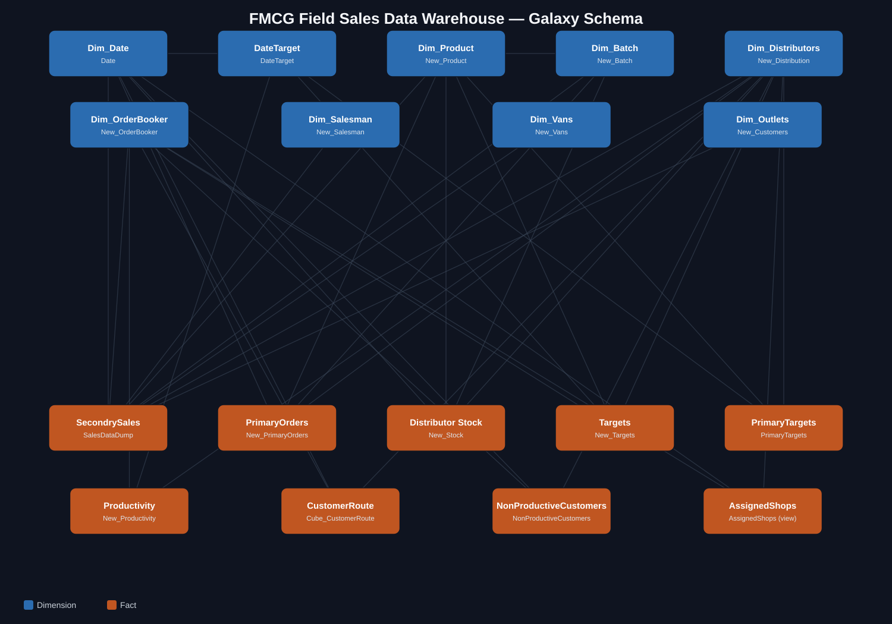
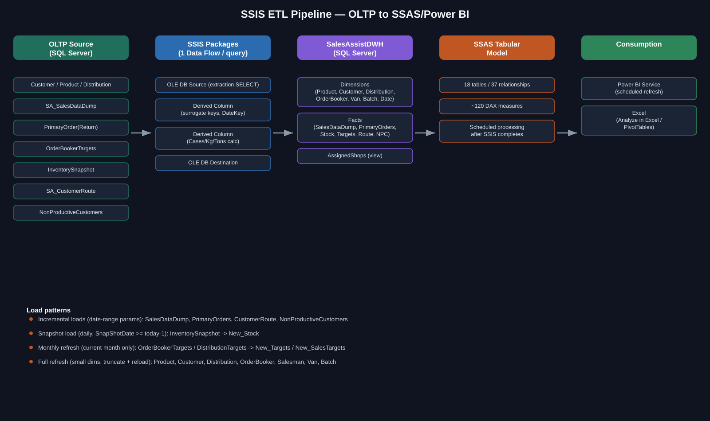

# FMCG Field Sales Data Warehouse

A galaxy-schema data warehouse for FMCG distributor field sales — built to turn
raw order-booker/route/sales transaction data into a daily Order Booker
performance scorecard, without losing per-invoice detail along the way.

**Stack:** SQL Server &middot; SSIS &middot; SSAS Tabular (DAX) &middot; Power BI &middot; Excel

---

## The problem

An FMCG distributor's field sales operation generates activity across several
disconnected systems: a route-planning module (who's supposed to visit which
outlet, when), an order/invoice system (what was actually sold), a
non-productive-visit log (attempted but failed visits), a primary-order system
(stock moving in from the manufacturer), and a stock/inventory snapshot. None of
these systems talk to each other natively — answering a question as simple as
*"what % of an Order Booker's planned route did they actually cover today?"*
means joining across all of them correctly, every day, for every Order Booker,
across every distributor.

This warehouse exists to answer exactly that class of question, reliably, at
scale, on a daily refresh cycle.

## Architecture



Nine fact tables share a common set of dimensions (Product, Customer,
Distribution, Order Booker, Salesman, Van, Date) — a **galaxy schema** rather
than a single star, because primary sales, secondary sales, stock, targets, and
route/productivity are genuinely different grains of activity that all need to
slice by the same dimensions.

**Pipeline:**



## Repository structure

```
FMCG-FieldSales-DWH/
├── docs/                        Architecture + ETL diagrams, data dictionary, ETL workflow notes
├── sql/
│   ├── schema/
│   │   ├── dimensions/          9 dimension tables (CREATE TABLE)
│   │   └── facts/                9 fact tables (CREATE TABLE)
│   ├── indexes/                 Non-clustered indexes derived from real query patterns
│   ├── etl/                     14 SSIS extraction queries (1 per Data Flow Task)
│   └── views/                   AssignedShops — SSAS-consumed productivity view
├── ssas/                        Tabular model docs: relationships, ER diagram, DAX measure catalogue
└── powerbi/                     Report structure (ICE Daily Tracker) + report-level DAX/UX patterns
```

Every folder has its own `README.md` — start at the top of whichever layer
you're interested in.

## A few engineering decisions worth highlighting

- **Status/Type as a universal filter contract.** Every additive measure on the
  main sales fact filters `Status="Settled", Type="Sales"` consistently, rather
  than each measure re-deriving "what counts as a real, delivered sale."
  One rule, applied ~60 times, instead of 60 slightly-different interpretations.
- **A calculated view (`AssignedShops`) instead of three separate measures.**
  Route coverage needed to count planned visits, unplanned-but-successful sales,
  *and* unplanned failed visits as the same kind of "assigned shop" — so that
  logic lives in one SQL view, unioned once, rather than being re-derived
  independently inside three different DAX measures that could silently drift
  out of sync with each other.
- **Two deliberately different target-proration strategies**, chosen per use
  case rather than forcing one pattern everywhere: OB-level monthly targets
  prorate to a daily rate live in DAX (because the date range in Power BI is
  arbitrary), while distribution-level primary targets pre-compute the per-day
  rate in the ETL (because that month's day-count is fixed and doesn't need to
  react to a slicer).
- **`Dim_Product` is deliberately *not* related to the productivity/route
  facts** — so a Brand slicer can't accidentally shrink the "how many shops
  were assigned" denominator used in coverage %.

Full rationale for each of these is in `ssas/model-overview.md` and
`ssas/dax-measures.md`.

## Setup (fresh environment)

```
1. Run /sql/schema/dimensions/*.sql, then /sql/schema/facts/*.sql
2. Run /sql/indexes/Recommended_Indexes.sql
3. Run /sql/views/AssignedShops.sql
4. Point SSIS packages at the queries in /sql/etl (bind date-range parameters
   per table — see docs/etl-workflow.md for load-pattern-by-table)
5. Process the SSAS Tabular model (relationships + measures documented in /ssas)
6. Connect Power BI / Excel to the Tabular model
```
